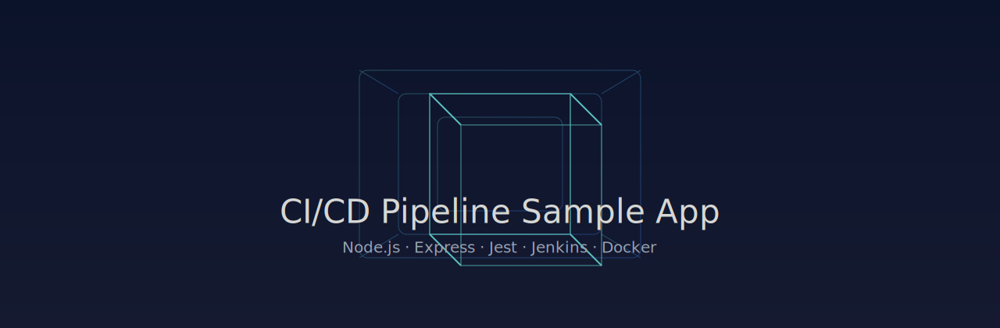
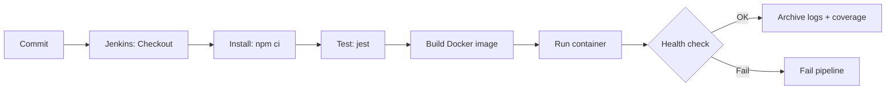
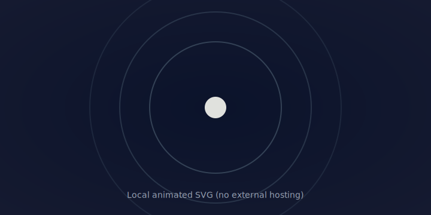

# 🚀 CI/CD Pipeline Sample App

<p align="center">
  
</p>

<p align="center">
  <a href="https://YOUR-JENKINS-HOST/job/ci-cd-pipeline/"></a>
  
  
  
  
</p>

A tiny Node.js + Express app with a minimal UI, wired to a Jenkins CI/CD pipeline and containerized with Docker. Includes a health endpoint, tests, and a Docker-based deploy step with smoke testing.

---

## ✨ Features

- **Express API**: `GET /api/health` returns `{ status: "ok" }`
- **UI/UX**: Static site in `public/` with a dynamic health badge
- **Tests**: Jest + Supertest with JUnit output for CI
- **Pipeline**: Jenkins stages for Install, Test, and Docker Deploy + health check
- **Docker**: Production Dockerfile with `--omit=dev` installs
- **Helpers**: npm scripts for docker build/run/stop/logs/health

---

## 🧪 Quick Start

### Local (Node)
```bash
npm ci
npm test
npm start
# open http://localhost:3000
```

### Local (Docker)
```bash
npm run docker:build
npm run docker:run
npm run docker:health
# open http://localhost:3001
```

Stop/cleanup:
```bash
npm run docker:stop
```

---

## 🧰 npm scripts

- `start`: start Express on port `3000`
- `test`: run Jest tests
- `test:ci`: run tests with coverage + JUnit output
- `docker:build`: build image `cicd-sample-app:local`
- `docker:run`: run container as `cicd-sample-app` mapping `3001:3000`
- `docker:health`: retry health probe against `http://localhost:3001/api/health`
- `docker:stop`: stop and remove the container
- `start:docker`: chain build → run → health

---

## 🏗️ Pipeline overview (Jenkins)



- Tests publish JUnit to `test-results/junit.xml` and archive coverage from `coverage/**`.
- Deploy stage builds an image, runs a container, smoke-tests `/api/health`, archives logs, and cleans up.

---

## 🧩 Project layout

```
.
├── app.js                # Express app (exports app)
├── index.js              # Server entry (listens on PORT)
├── public/               # Minimal UI (static)
│   ├── index.html
│   ├── styles.css
│   └── app.js
├── __tests__/            # Jest + Supertest tests
│   └── app.test.js
├── Jenkinsfile           # CI/CD pipeline (Install/Test/Deploy via Docker)
├── Dockerfile            # Production image
├── .dockerignore
├── .gitignore
└── package.json
```

---

## 🧨 API

- `GET /api/health` → `{ status: "ok" }`

---

## 🧭 3D visuals and animations

- **3D animated banner**: see the wireframe animation above.
- **WebGL demo (external)**: Rotating cube on Three.js examples → https://threejs.org/examples/#webgl_animation_keyframes
- **Animated pipeline**: You can attach your Jenkins job status badge or a GIF of your pipeline run here.

> Tip: For richer visuals, consider adding a GIF of your app UI or a short video capture of the Jenkins run.

---

## 🛠️ Environment

- Node.js 18+
- Docker (optional for local runs, required for Deploy stage in Jenkins agents)

---

## 📦 Docker

Build and run manually without npm helpers:
```bash
docker build -t cicd-sample-app:local .
docker run --rm -d --name cicd-sample-app -p 3001:3000 cicd-sample-app:local
curl http://localhost:3001/api/health
```

---

## ✅ Status

- Express + UI, tests, Dockerfile, and Jenkins pipeline are ready to go.
- Deploy stage performs a containerized smoke test automatically.

---

<p align="center">
  
  <br/>
  <sub>Animated orbit for vibes ✨</sub>
</p>
